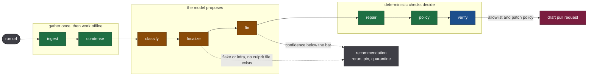

# Architecture

## The shape of it

| colour | meaning |
| --- | --- |
| green | deterministic, no model call, unit tested |
| amber | model call, output validated as a proposal and scored by the eval harness |
| blue | runs in a container, judged by whether the build passes |
| red | writes to a repository, and only behind an allowlist that is empty by default |

Three model calls, surrounded by deterministic code on both sides. Everything a model returns is a pydantic-validated proposal; only `guardrails/` and `pipeline/verify.py` may approve anything. The dotted paths matter as much as the solid one: for a flake or a runner outage there is no culprit file to name, and the honest output is a recommendation rather than a patch.

## Why the stages split where they do

**Ingest is the boundary between online and offline.** It resolves a run URL to a `RunSnapshot` holding the failing job's log, the diff as of the failing commit, and the run metadata. After that, triage never touches the network. That is what makes a stored eval case behave exactly like a live run, and it is why the benchmark still works after GitHub deletes the logs at ninety days.

One subtlety worth knowing: the diff comes from comparing the pull request's base to the exact failing commit, not from the pull request endpoint. A pull request diff follows the branch tip, so by the time a case is curated it can show code that did not exist when the log was written. That bug was live for a while and produced cases whose diff contained the very fix the log complained was missing.

**Condense exists because logs do not fit.** Real failure logs in the dataset run from 39 to 36,000 lines. The router greps a library of error patterns and emits merged context windows around the hits, falling back to the log tail when nothing matches. Line numbers refer to the cleaned log, so the drill-down tools can address them coherently.

**Classify and localize are separate calls** because the class decides whether localization is even meaningful. A flake or a runner outage has no culprit file, and asking for one produces a path somebody then goes and reads.

**Fix is gated twice** before it runs: the class must imply a repository file is at fault, and the classifier must have been confident enough to act on. Below either bar the agent returns a recommendation instead of a patch.

## The layers

| Package | Responsibility |
| --- | --- |
| `models/` | Every pydantic model. The stage boundaries are these types, so a change here is a change to the contract. |
| `providers/` | `CIProvider` protocol and its GitHub implementation. One `GitHubWriter` is the only code that writes. |
| `condense/` | Pure text reduction. No model, no network. |
| `llm/` | One OpenAI-compatible client for every provider, plus a registry, rate limiter, and structured-output enforcement. |
| `prompts/` | Versioned markdown, content hashed into every scorecard so a metric traces to the prompt that produced it. |
| `pipeline/` | One module per stage, each a typed function. |
| `tools/` | Read-only views over a case's evidence, so drill-down works offline. |
| `guardrails/` | Allowlist and patch policy. Small enough to audit in a minute. |
| `sandbox/` | Container execution for checking a patch really works. |
| `dataset/` | Loading and validating cases, and importing executable artifacts. |
| `telemetry/` | OpenTelemetry setup and the attribute names, kept in one file. |
| `evals/` | Scoring, scorecards, and the regression gate. Imports `buildsleuth`, never the reverse. |

The dependency rule is one way: `evals/` may import `buildsleuth`, and nothing in `buildsleuth` may import `evals`. That is what stops a metric quietly influencing the thing it measures.

## Decisions that cost something

**One client for four providers.** Providers differ only in base URL, model id, and quirks, all of which the registry carries. There is therefore one HTTP path to test and one place where retries and redaction happen. The cost is a quirks table that has grown three fields as reality intruded: whether a provider enforces JSON schemas, whether it accepts `response_format` at all, and whether it is a reasoning model whose hidden thinking is billed against the output budget.

**The schema always travels in the prompt**, even for providers that enforce it natively. It costs a few tokens and means one code path works across providers whose JSON support ranges from strict schemas to nothing.

**Writes are never retried.** A retried create leaves a second branch or a duplicate pull request behind, which is worse than failing once.

**Tracing is hand-written OpenTelemetry**, not a vendor SDK. Every `gen_ai.*` attribute name is a constant in `telemetry/attrs.py`, because those conventions are still moving and a rename should be a one-file diff. Exception recording is off by default: the SDK writes full stack traces, and provider errors routinely echo the request including its `Authorization` header.

## Adding another CI provider

Implement `CIProvider` in `providers/`, and the contract test suite in `tests/contract/` applies to it unchanged. Nothing above `providers/` knows GitHub exists.
